# SG-Gateway

**Лёгкая и быстрая веб-панель для личного и семейного VPN.**

> **Один сервер. Одна панель. Семейный VPN без серверной акробатики.**


SG-Gateway устанавливается на **один самостоятельный Ubuntu-сервер** и превращает его в готовый VPN-шлюз с удобным веб-интерфейсом.

Он предназначен для дома, семьи и небольшой группы доверенных пользователей. Здесь нет Controller, SG-Nodes, Cluster, Cascade, распределённой базы серверов и ручного редактора полного JSON.

**Gateway — это просто выход в интернет. Без квантовой механики.**

Установили панель, создали клиентов и устройства, получили ссылки, QR-коды и подписки — пользуетесь.

### System — состояние сервера

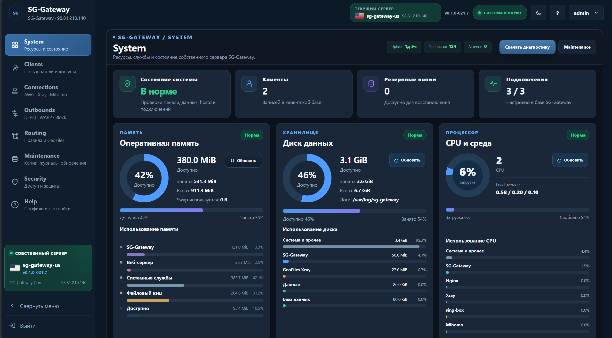

## Что изменилось в SG-Gateway 0.1.0-021.9

### Персональная подписка устройства

Панель выдаёт стабильную ссылку `/sub/<token>`. Клиент загружает по ней Base64-подписку с настоящими переносами строк. Имя подписки формируется как `SG-Gateway · клиент · устройство` без `.txt`.

### Mieru без потери совместимости

Для каждого устройства одновременно доступны обычная ссылка `mierus://` и её QR для SG Client, отдельный Mieru JSON с собственным QR, а также Mihomo YAML. JSON использует текущий адрес и порт сервера и индивидуальные username/password устройства.

### Мобильная версия панели

На экранах до 760 px боковое меню превращается в полноширинную мобильную навигацию с читаемыми названиями, крупными иконками, карточкой сервера и нормальными кнопками темы и выхода. Сворачивание действительно скрывает длинное меню, а не оставляет узкую боковую рейку. Desktop-разметка не изменяется.

### Routing и редактирование доступов

В Routing подписи `Direct`, `WARP` и `Block` заменены понятными вариантами «Через SG-Gateway», «Через WARP» и «Заблокировать», при этом внутренние Xray-теги сохранены. Клиента и дополнительные устройства можно редактировать: менять имя, срок и набор протоколов без перевыпуска неизменённых UUID, паролей, токенов и ссылок; неудачное применение откатывается.

## Что изменилось в SG-Gateway 0.1.0-021.8

Версия `0.1.0-021.8` собрала большую доводку уже существующей панели. Мы упростили установку и первый запуск, переработали страницу состояния сервера, вернули смену пароля, сделали понятнее создание клиентов и исправили обновление работающего SG-Gateway.

### System

Раньше страница System показывала основные значения CPU, памяти и диска. Теперь на ней видно не только общий расход ресурсов, но и то, чем именно занят сервер: SG-Gateway, Xray, Nginx, Mihomo, sing-box, база, логи, резервные копии и GeoFiles.

Исправлен расчёт памяти: занятое, доступное, файловый кэш и действительно свободная память больше не смешиваются. Карточки CPU, памяти и диска приведены к одному размеру и одинаково читаются в светлой и тёмной темах.

| Ресурсы сервера | Трафик, процессы и проверки |
| --- | --- |
|  | 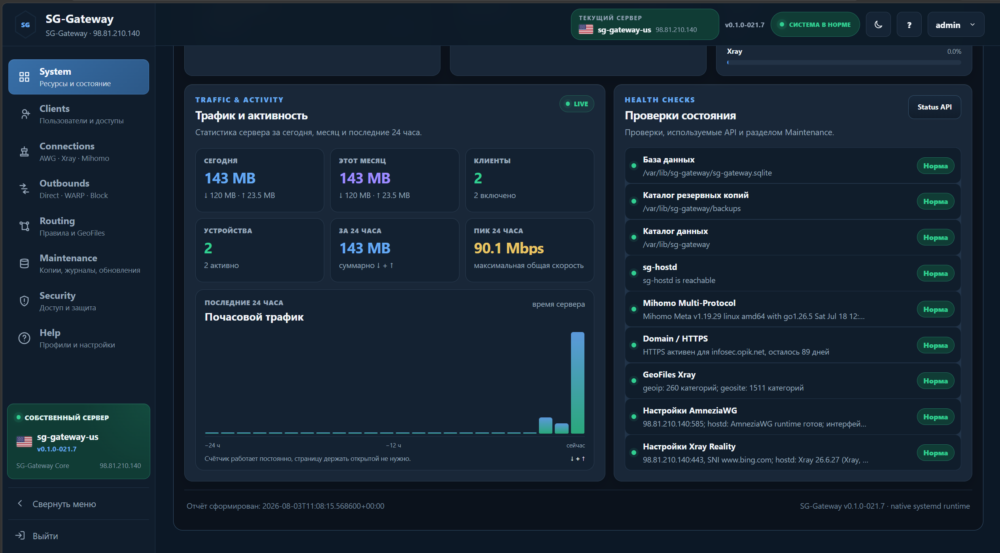 |

### Установка и первый клиент

При чистой установке теперь нужно задать только пароль администратора и повторить его. Публичный IP, страна, имя сервера, порты, Reality Target, SNI и остальные технические параметры назначаются автоматически.

Сразу после установки создаётся первый VPN-клиент `sg-admin` с основными профилями. В Clients поясняется, что это клиент для первоначальной проверки, а не пользователь Ubuntu и не логин панели. После создания собственных клиентов `sg-admin` можно удалить.

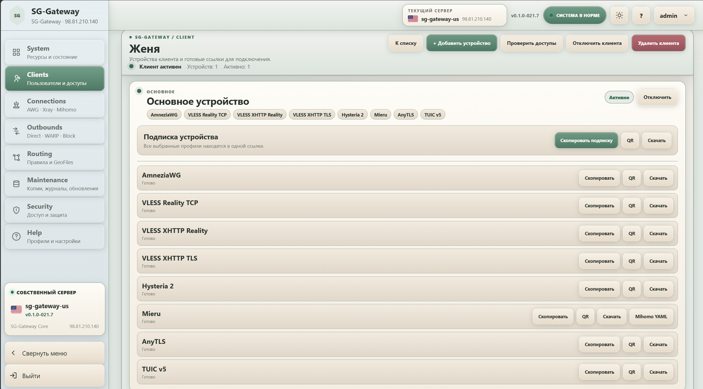

### Connections

Окно создания клиента теперь показывает восемь реальных VPN-профилей в стабильной сетке. SG Client больше не выглядит отдельным протоколом — персональная subscription создаётся автоматически.

Для профилей, которым пока не хватает HTTPS или других настроек, показывается причина. Для AnyTLS и TUIC v5 используется понятное сообщение:

> **Будет включён после создания клиента с этим профилем**

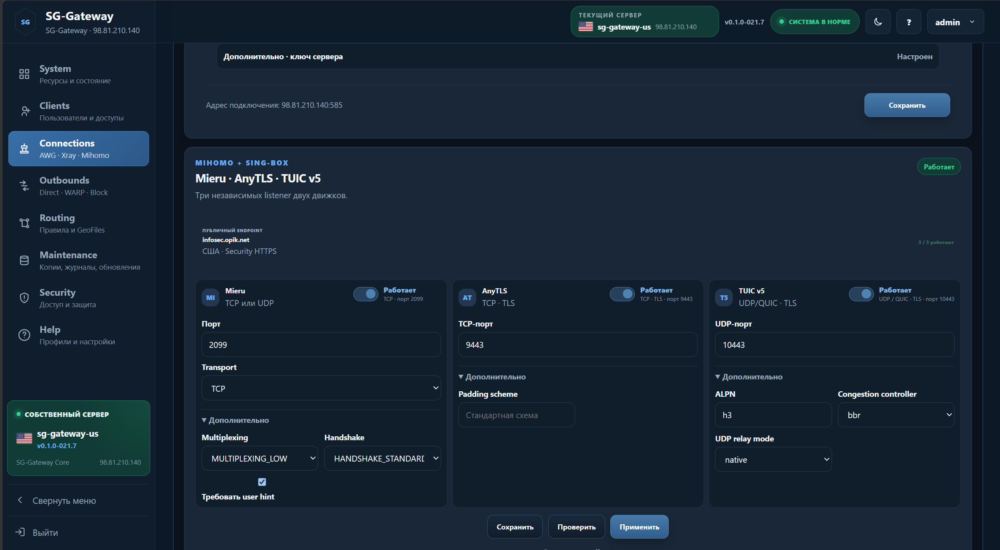

### Routing, GeoFiles и WARP

Экран Routing стал понятнее: источники GeoFiles, проверка категорий и правила маршрутизации собраны в одном рабочем порядке. WARP остаётся обычным outbound, который можно назначать правилам вместе с Direct и Block.

| Routing и GeoFiles | WARP Outbound |
| --- | --- |
| 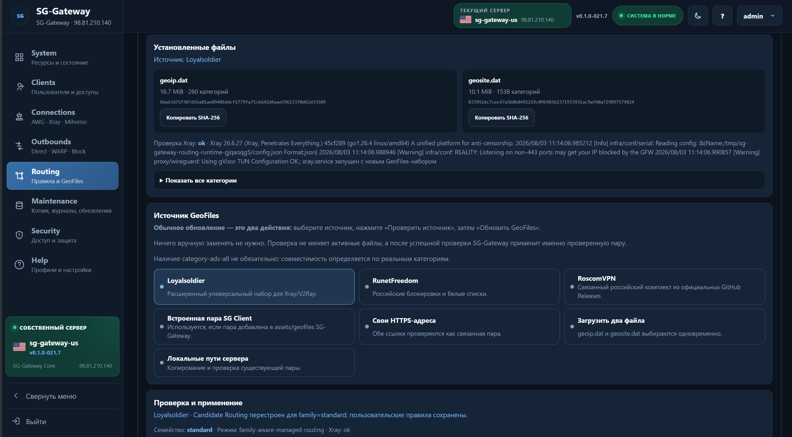 | 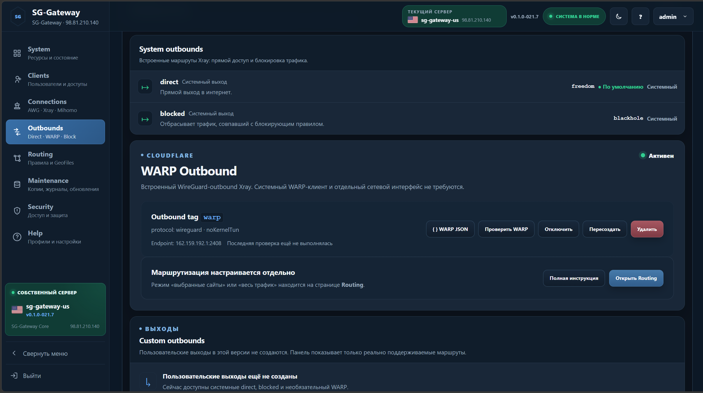 |

### Security

В Security снова можно сменить пароль администратора прямо из панели. Здесь же отображаются текущий режим доступа, домен, сертификат и состояние HTTPS.

| Смена пароля | Сертификат и режим доступа |
| --- | --- |
| 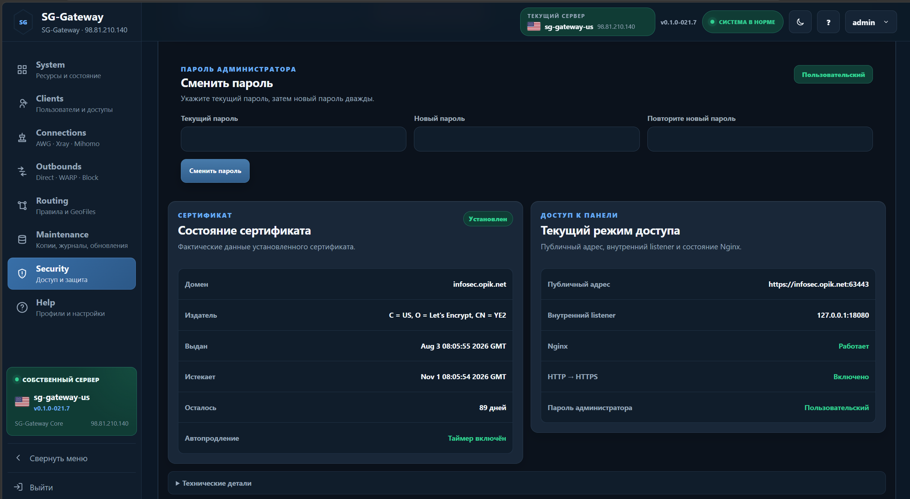 | 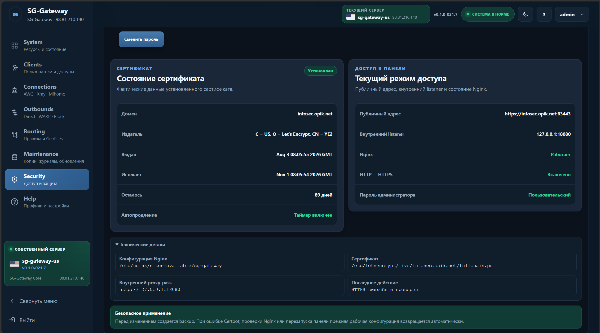 |

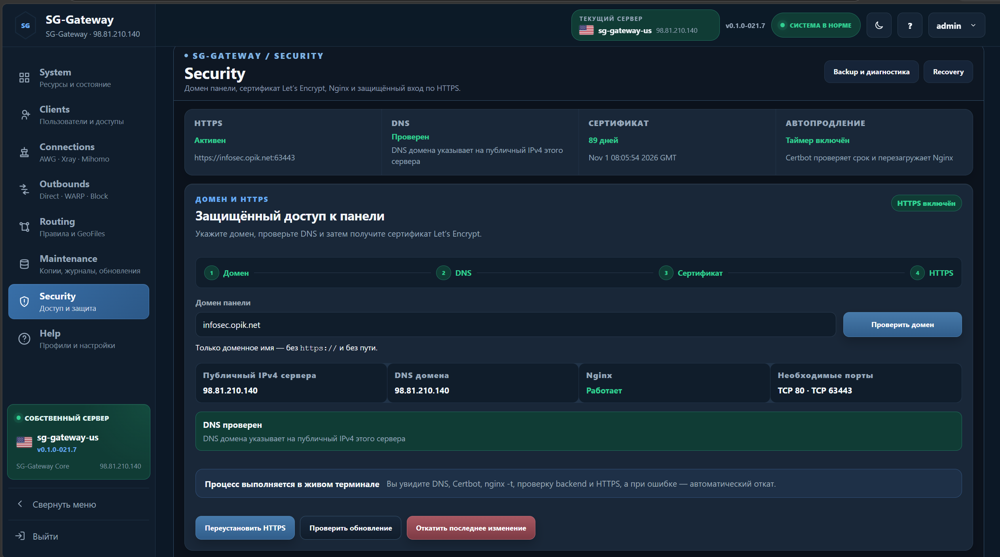

### Обновление

Для чистой установки и обновления используется одна команда:

```bash
curl -fsSL https://raw.githubusercontent.com/s-gor/sg-gateway/main/deploy/install-from-github.sh | sudo bash
```

На новом сервере она запускает чистую установку. Если SG-Gateway уже установлен, команда автоматически переходит в режим обновления и не задаёт повторных вопросов.

Раньше обновление сохраняло клиентов и базу, но могло заменить рабочую HTTPS-конфигурацию Nginx обычным HTTP-шаблоном. После этого HTTPS приходилось включать заново.

Теперь при обновлении сохраняются пароль администратора, клиенты, устройства, UUID, ключи, настройки подключений, домен, сертификат Let’s Encrypt, конфигурация Nginx и renewal hook. После обновления панель проверяется по сохранённому HTTPS-адресу. Если рабочую конфигурацию сохранить и проверить нельзя, установщик выполняет откат к резервной копии.

Также удалены предварительные проверки портов, которые могли ошибочно остановить установку до запуска реальных служб.

## Две дороги

### Хочу установить и пользоваться

Продолжайте читать этот `README.md`. Здесь есть назначение панели, поддерживаемые подключения, установка, обновление и удаление.

### Хочу понимать, что происходит внутри

Откройте [техническое устройство SG-Gateway](docs/TECHNICAL.md): архитектура, XTLS Vision, VLESS Encryption, XMUX, службы, порты, HTTPS, Routing, GeoFiles и сохранность данных.

## Для кого создан SG-Gateway

SG-Gateway подходит, когда нужен:

- собственный VPN на одном VPS или EC2;
- доступ для семьи и близких;
- несколько устройств у каждого человека;
- современные профили Xray;
- AmneziaWG и дополнительные подключения;
- понятная маршрутизация;
- HTTPS, резервные копии и диагностика;
- управление без ручной сборки серверных JSON-конфигураций.

Для сети из нескольких серверов, SG-Nodes, Cluster и Cascade существует отдельный большой проект **SG-Panel**.

> **SG-Panel — для сложной инфраструктуры.
> SG-Gateway — для дома, семьи и спокойной жизни.**

## Что поддерживается

### Connections — общий экран


### Xray

SG-Gateway поддерживает современные профили Xray:

- **VLESS Reality TCP + XTLS Vision**;
- **VLESS XHTTP Reality + XTLS Vision + VLESS Encryption + XMUX для РФ**;
- **VLESS XHTTP TLS + XTLS Vision + VLESS Encryption + HTTPS + XMUX для РФ**;
- **Hysteria 2 + TLS + Salamander FinalMask**.

Панель сама создаёт серверные конфигурации, проверяет их перед применением и формирует клиентские ссылки. Ручное редактирование полного JSON не требуется.


### AmneziaWG

Поддерживаются:

- сервер AmneziaWG;
- фиксированный внешний UDP-порт `585`;
- отдельные ключи и адреса устройств;
- клиентские конфигурации;
- управление службой из панели;
- совместимость с клиентами AmneziaVPN и AmneziaWG.


### Mihomo и sing-box

Рабочая архитектура разделена по движкам:

- **Mieru** обслуживается Mihomo;
- **AnyTLS** обслуживается отдельным sing-box;
- **TUIC v5** обслуживается отдельным sing-box.

Эти дополнительные движки применяются независимо и управляются из общей панели SG-Gateway.


### Cloudflare WARP

WARP используется как отдельный outbound. Routing решает, какой трафик отправить через `Direct`, `WARP` или `Block`.

WARP находится среди выходов, где ему и положено быть, а не изображает из себя отдельную философскую школу маршрутизации.


## Клиенты и устройства

В SG-Gateway используется простая модель:

```text
Клиент
  └── Устройства
      ├── Телефон
      ├── Ноутбук
      └── Телевизор
```

Каждое устройство может получить собственные:

- UUID и реквизиты доступа;
- наборы разрешённых профилей;
- ссылку подключения;
- QR-код;
- файл конфигурации;
- персональную SG Client subscription.

Клиента или отдельное устройство можно временно отключить без удаления.

### Clients — список и карточка клиента

| Список клиентов | Карточка клиента |
| --- | --- |
|  |  |

### Добавление устройства

| Основные параметры | Выбор подключений |
| --- | --- |
| 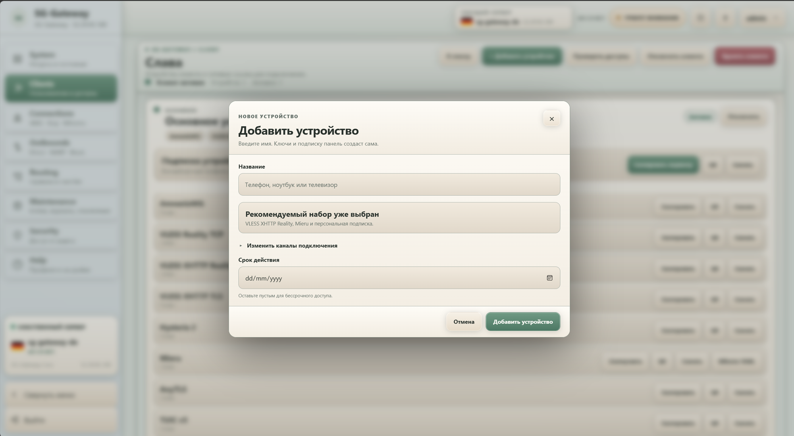 | 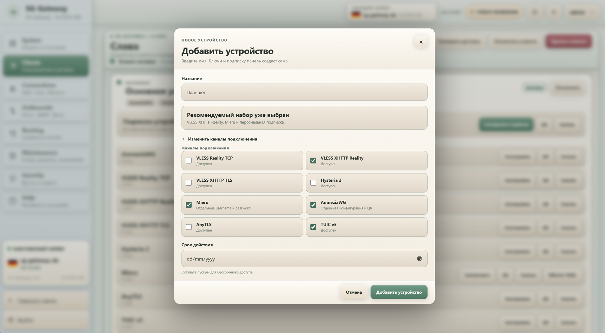 |

## Routing и GeoFiles

Панель управляет направлениями:

- `Direct`;
- `WARP`;
- `Block`.

Поддерживаются доменные и IP-правила, готовые наборы и пользовательские правила.

GeoFiles работают парой `geoip.dat` + `geosite.dat`. Доступны встроенные и внешние источники, пользовательские HTTPS-адреса, загрузка файлов и локальные пути сервера.

**Обычное обновление занимает всего два действия после выбора источника:** нажать **«Проверить источник»**, затем **«Обновить GeoFiles»**. Вручную копировать или заменять GeoFiles на сервере не требуется.

Перед применением SG-Gateway сам проверяет реальный набор категорий, строит совместимый будущий Routing и полный Xray config, создаёт backup и выполняет безопасное переключение. Несовместимая пользовательская Geo-категория блокирует применение с указанием правила, но само правило не удаляется.

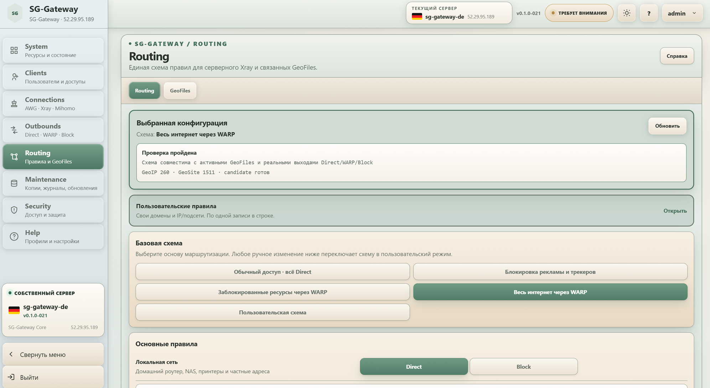

Пошагово: [простое обновление GeoFiles](docs/ROUTING.md#простое-обновление-geofiles).

## HTTPS и безопасность

HTTPS включается из раздела **Security** после направления домена на публичный IPv4 сервера.

Панель:

1. проверяет домен и DNS;
2. получает сертификат Let’s Encrypt;
3. создаёт резервную копию текущей конфигурации;
4. проверяет Nginx;
5. переключает панель на HTTPS;
6. проверяет backend и внешний адрес;
7. подтверждает рабочее состояние HTTPS.

Веб-процесс работает без root-прав. Привилегированные операции выполняет отдельная служба HostD.

| Security | Сертификат и режим доступа |
| --- | --- |
|  |  |

## Обслуживание

В панели доступны:

- состояние ресурсов и служб;
- журналы;
- диагностика;
- резервные копии;
- восстановление;
- обновление компонентов;
- проверка Xray;
- полное удаление SG-Gateway.

Диагностика показывает состояние основных служб и компонентов в понятном виде.

| Maintenance | Обновление компонентов |
| --- | --- |
|  |  |

## А где подсчёт трафика?

Персонального подсчёта трафика клиентов пока нет.

SG-Gateway создавался для семейного VPN, а не для домашнего биллинга и вечернего расследования:

> «Кто за три дня потратил 280 гигабайт и почему снова виноват телевизор?»

Мы посмотрим, насколько индивидуальная статистика действительно нужна пользователям. Если функция окажется востребованной, она может появиться позднее как необязательная возможность.

> **Без учёта семейных гигабайтов — для сохранения мира в доме.**

## Чего здесь намеренно нет

SG-Gateway не является уменьшенной копией всей SG-Panel. В нём намеренно нет:

- Controller и SG-Nodes;
- Cluster и Cascade;
- управления группой VPS;
- распределённой базы клиентов;
- переноса клиентов между серверами;
- ручного редактора полного JSON;
- биллинга, тарифов и квот;
- обязательного персонального учёта трафика;

Это не список забытых функций. Это границы проекта.

## Установка

Используйте чистую Ubuntu EC2/VPS:

```bash
curl -fsSL https://raw.githubusercontent.com/s-gor/sg-gateway/main/deploy/install-from-github.sh | sudo bash
```

После установки панель доступна по адресу, показанному установщиком. Начальная настройка может выполняться по HTTP и IP; домен и HTTPS добавляются позднее из раздела `Security`.

## Первые шаги

1. Откройте панель и войдите.
2. Проверьте состояние сервера на странице `System`.
3. Настройте нужные профили в `Connections`.
4. Создайте клиента и его устройства.
5. Получите ссылки, QR-коды или subscription.
6. При необходимости настройте `WARP`, `Routing` и `GeoFiles`.
7. Подключите домен и HTTPS.

## Обновление

Для обновления используется та же команда:

```bash
curl -fsSL https://raw.githubusercontent.com/s-gor/sg-gateway/main/deploy/install-from-github.sh | sudo bash
```

Updater сохраняет управляемые данные и резервную копию текущего состояния перед обновлением.

## Полное удаление

```bash
curl -fsSL https://raw.githubusercontent.com/s-gor/sg-gateway/main/deploy/full-uninstall-ubuntu.sh | sudo bash
```

Подтверждение:

```text
DELETE SG-GATEWAY
```

Удаляются приложение, данные и управляемые SG-Gateway службы и конфигурации. Общие пакеты Ubuntu намеренно сохраняются.

## Документация

Встроенный раздел **Help** повторяет тот же рабочий порядок: System → Clients → Connections → Routing → Maintenance → Security.

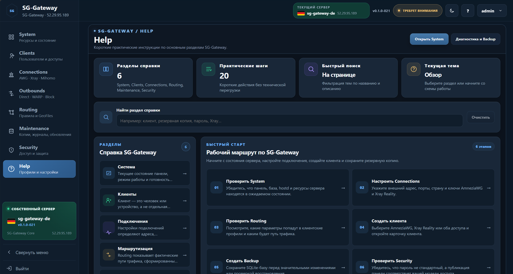

### Для пользователя

- [Начало работы](docs/README.md)
- [Установка и обновление](docs/INSTALLATION.md)
- [Руководство пользователя](docs/USER-GUIDE.md)
- [Connections и клиентские профили](docs/CONNECTIONS.md)
- [Routing и GeoFiles](docs/ROUTING.md)
- [HTTPS и безопасность](docs/security.md)
- [Maintenance и диагностика](docs/MAINTENANCE.md)
- [Полное удаление](docs/UNINSTALL.md)

### Для понимающего пользователя

- [Техническое устройство SG-Gateway](docs/TECHNICAL.md)

**Один сервер. Одна панель. Нормальный выход в интернет.**
