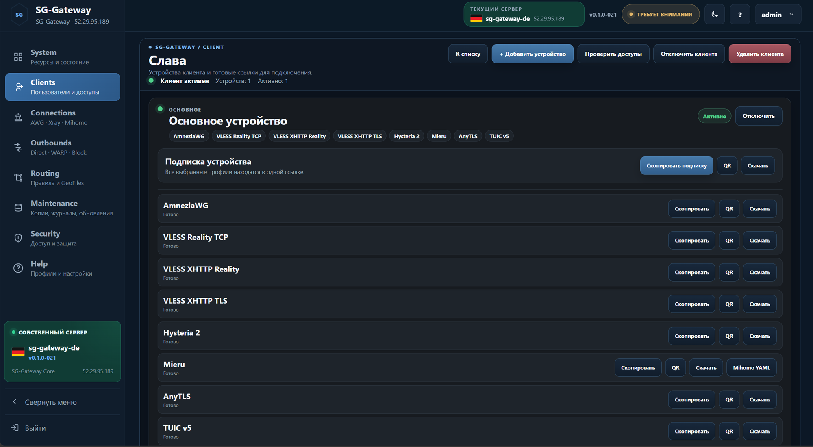
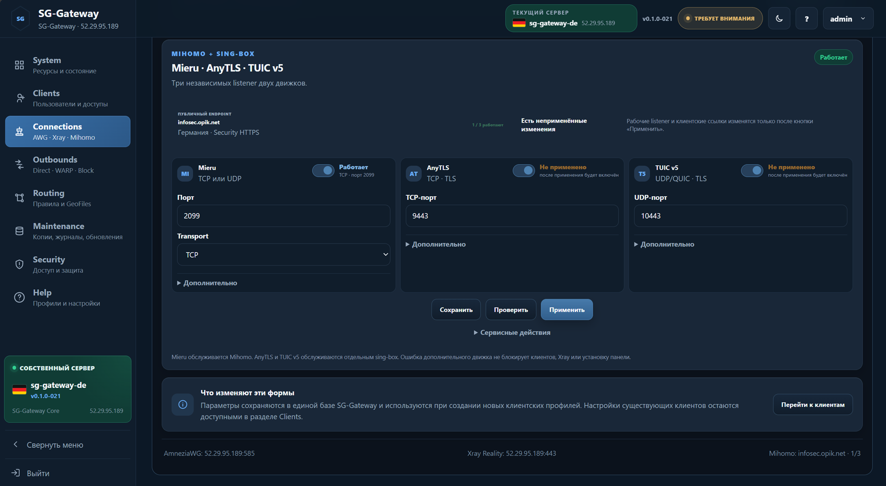
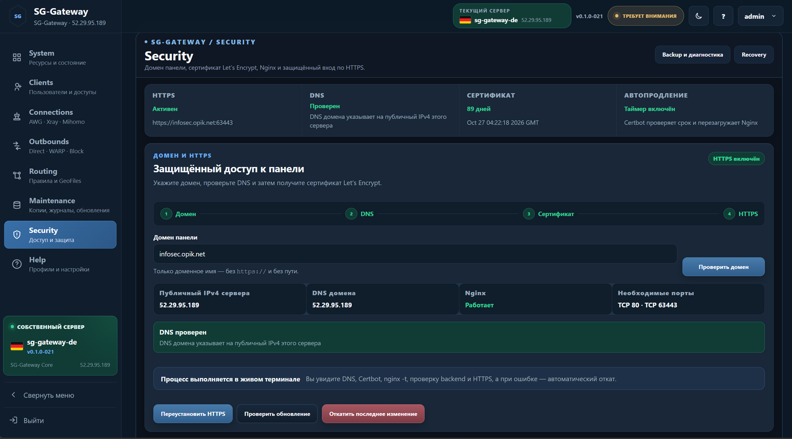

# SG-Gateway

**Лёгкая и быстрая веб-панель для личного и семейного VPN.**

> **Один сервер. Одна панель. Семейный VPN без серверной акробатики.**


SG-Gateway устанавливается на **один самостоятельный Ubuntu-сервер** и превращает его в готовый VPN-шлюз с удобным веб-интерфейсом.

Он предназначен для дома, семьи и небольшой группы доверенных пользователей. Здесь нет Controller, SG-Nodes, Cluster, Cascade, распределённой базы серверов и ручного редактора полного JSON.

**Gateway — это просто выход в интернет. Без квантовой механики.**

Установили панель, создали клиентов и устройства, получили ссылки, QR-коды и подписки — пользуетесь.

## Две дороги

### Хочу установить и пользоваться

Продолжайте читать этот `README.md`. Здесь есть назначение панели, поддерживаемые подключения, установка, обновление и удаление.

### Хочу понимать, что происходит внутри

Откройте [техническое устройство SG-Gateway](docs/TECHNICAL.md): архитектура, XTLS Vision, VLESS Encryption, XMUX, службы, порты, HTTPS, Routing, GeoFiles и сохранность данных.

## Интерфейс

Ниже — реальные экраны SG-Gateway 021. Интерфейс одинаково работает в тёмной и светлой теме.

| System | Clients |
| --- | --- |
|  |  |
| **Карточка клиента** | **Добавление устройства** |
|  |  |
| **Выбор подключений устройства** | **Connections** |
|  |  |
| **Настройки Xray** | **AmneziaWG** |
|  |  |
| **Дополнительные подключения** | **WARP Outbound** |
|  |  |
| **Routing** | **Security / HTTPS** |
|  |  |
| **Состояние безопасности** | **Help** |
|  |  |
| **Maintenance** | **Обновление компонентов** |
|  |  |

## Для кого создан SG-Gateway

SG-Gateway подходит, когда нужен:

- собственный VPN на одном VPS или EC2;
- доступ для семьи и близких;
- несколько устройств у каждого человека;
- современные профили Xray;
- AmneziaWG и дополнительные подключения;
- понятная маршрутизация;
- HTTPS, резервные копии и диагностика;
- управление без ручной сборки серверных JSON-конфигураций.

Для сети из нескольких серверов, SG-Nodes, Cluster и Cascade существует отдельный большой проект **SG-Panel**.

> **SG-Panel — для сложной инфраструктуры.
> SG-Gateway — для дома, семьи и спокойной жизни.**

## Что поддерживается

### Xray

SG-Gateway поддерживает современные профили Xray:

- **VLESS Reality TCP + XTLS Vision**;
- **VLESS XHTTP Reality + XTLS Vision + VLESS Encryption + XMUX для РФ**;
- **VLESS XHTTP TLS + XTLS Vision + VLESS Encryption + HTTPS + XMUX для РФ**;
- **Hysteria 2 + TLS + Salamander FinalMask**.

Панель сама создаёт серверные конфигурации, проверяет их перед применением и формирует клиентские ссылки. Ручное редактирование полного JSON не требуется.

### AmneziaWG

Поддерживаются:

- сервер AmneziaWG;
- фиксированный внешний UDP-порт `585`;
- отдельные ключи и адреса устройств;
- клиентские конфигурации;
- управление службой из панели;
- совместимость с клиентами AmneziaVPN и AmneziaWG.

### Mihomo и sing-box

Рабочая архитектура разделена по движкам:

- **Mieru** обслуживается Mihomo;
- **AnyTLS** обслуживается отдельным sing-box;
- **TUIC v5** обслуживается отдельным sing-box.

Эти дополнительные движки применяются независимо. Их ошибка показывается в
диагностике, но больше не отменяет создание или удаление клиента, применение
Xray и AmneziaWG либо установку всей панели.

### Cloudflare WARP

WARP используется как отдельный outbound. Routing решает, какой трафик отправить через `Direct`, `WARP` или `Block`.

WARP находится среди выходов, где ему и положено быть, а не изображает из себя отдельную философскую школу маршрутизации.

## Клиенты и устройства

В SG-Gateway используется простая модель:

```text
Клиент
  └── Устройства
      ├── Телефон
      ├── Ноутбук
      └── Телевизор
```

Каждое устройство может получить собственные:

- UUID и реквизиты доступа;
- наборы разрешённых профилей;
- ссылку подключения;
- QR-код;
- файл конфигурации;
- персональную SG Client subscription.

Клиента или отдельное устройство можно временно отключить без удаления.

## Routing и GeoFiles

Панель управляет направлениями:

- `Direct`;
- `WARP`;
- `Block`.

Поддерживаются доменные и IP-правила, готовые наборы и пользовательские правила.

GeoFiles работают парой `geoip.dat` + `geosite.dat`. Доступны встроенные и внешние источники, пользовательские HTTPS-адреса, загрузка файлов и локальные пути сервера.

Перед применением SG-Gateway строит будущую конфигурацию и проверяет её через Xray. Несовместимая Geo-категория блокирует применение, но пользовательские правила не удаляются автоматически.

## HTTPS и безопасность

HTTPS включается из раздела **Security** после направления домена на публичный IPv4 сервера.

Панель:

1. проверяет домен и DNS;
2. получает сертификат Let’s Encrypt;
3. создаёт страховочную копию;
4. проверяет Nginx;
5. переключает панель на HTTPS;
6. проверяет backend и внешний адрес;
7. выполняет rollback при ошибке.

Веб-процесс работает без root-прав. Привилегированные операции выполняет отдельная служба HostD.

## Обслуживание

В панели доступны:

- состояние ресурсов и служб;
- журналы;
- диагностика;
- резервные копии;
- восстановление;
- обновление компонентов;
- проверка Xray;
- полное удаление SG-Gateway.

Панель старается объяснить проблему человеческим языком, а не просто показать красную строку из systemd и пожелать удачи.

## А где подсчёт трафика?

Персонального подсчёта трафика клиентов пока нет.

SG-Gateway создавался для семейного VPN, а не для домашнего биллинга и вечернего расследования:

> «Кто за три дня потратил 280 гигабайт и почему снова виноват телевизор?»

Мы посмотрим, насколько индивидуальная статистика действительно нужна пользователям. Если функция окажется востребованной, она может появиться позднее как необязательная возможность.

> **Без учёта семейных гигабайтов — для сохранения мира в доме.**

## Чего здесь намеренно нет

SG-Gateway не является уменьшенной копией всей SG-Panel. В нём намеренно нет:

- Controller и SG-Nodes;
- Cluster и Cascade;
- управления группой VPS;
- распределённой базы клиентов;
- переноса клиентов между серверами;
- ручного редактора полного JSON;
- биллинга, тарифов и квот;
- обязательного персонального учёта трафика;
- Docker.

Это не список забытых функций. Это границы проекта.

## Установка

Используйте чистую Ubuntu EC2/VPS:

```bash
sudo apt-get update && sudo apt-get install -y ca-certificates curl tar gzip && curl -fsSL https://raw.githubusercontent.com/s-gor/sg-gateway/main/deploy/install-from-github.sh | sudo bash
```

После установки панель доступна по адресу, показанному установщиком. Начальная настройка может выполняться по HTTP и IP; домен и HTTPS добавляются позднее из раздела `Security`.

## Первые шаги

1. Откройте панель и войдите.
2. Проверьте состояние сервера на странице `System`.
3. Настройте нужные профили в `Connections`.
4. Создайте клиента и его устройства.
5. Получите ссылки, QR-коды или subscription.
6. При необходимости настройте `WARP`, `Routing` и `GeoFiles`.
7. Подключите домен и HTTPS.

## Обновление

Для обновления используется та же команда:

```bash
sudo apt-get update && sudo apt-get install -y ca-certificates curl tar gzip && curl -fsSL https://raw.githubusercontent.com/s-gor/sg-gateway/main/deploy/install-from-github.sh | sudo bash
```

Updater сохраняет управляемые данные и создаёт страховочную копию перед изменением сервера.

## Полное удаление

```bash
curl -fsSL https://raw.githubusercontent.com/s-gor/sg-gateway/main/deploy/full-uninstall-ubuntu.sh | sudo bash
```

Подтверждение:

```text
DELETE SG-GATEWAY
```

Удаляются приложение, данные и управляемые SG-Gateway службы и конфигурации. Общие пакеты Ubuntu намеренно сохраняются.

## Документация

### Для пользователя

- [Начало работы](docs/README.md)
- [Установка и обновление](docs/INSTALLATION.md)
- [Руководство пользователя](docs/USER-GUIDE.md)
- [Connections и клиентские профили](docs/CONNECTIONS.md)
- [Routing и GeoFiles](docs/ROUTING.md)
- [HTTPS и безопасность](docs/security.md)
- [Maintenance и диагностика](docs/MAINTENANCE.md)
- [Полное удаление](docs/UNINSTALL.md)

### Для понимающего пользователя

- [Техническое устройство SG-Gateway](docs/TECHNICAL.md)

## Текущая линия

- проект: `SG-Gateway`;
- линия: `021`;
- версия приложения: `0.1.0-021`;
- ветка: `main`;
- установка: нативная Ubuntu + systemd;
- автономный установщик: `SG-Gateway-021-FULL-CLEAN-EC2-REBUILT.run`.

**Один сервер. Одна панель. Нормальный выход в интернет.**
